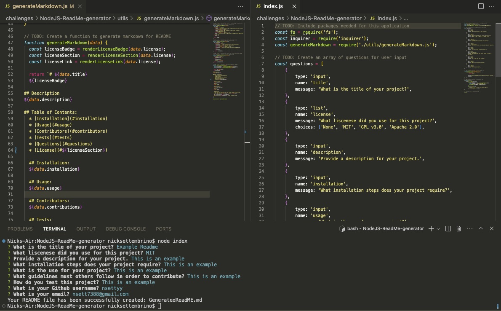
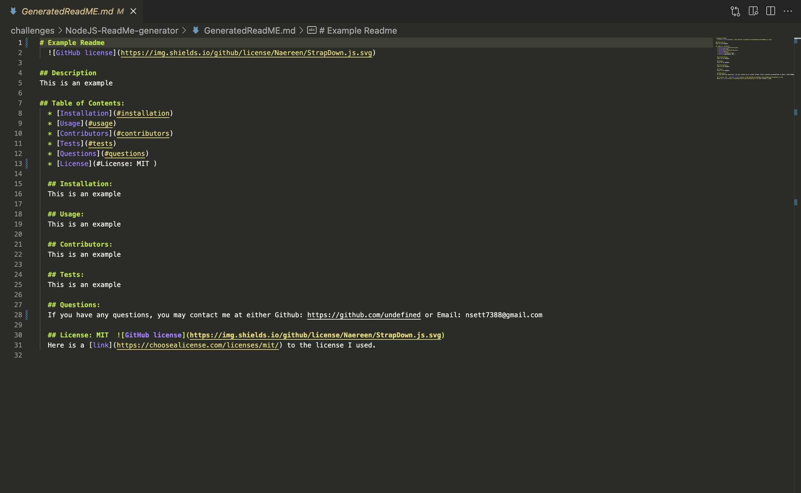

# README.md Generator 
  

## Description
This is a command line project that generates readme files based on a user's input.

## Screenshots

## Table of Contents:
  * [Installation](#installation)
  * [Usage](#usage)
  * [Contributors](#contributors)
  * [Tests](#tests)
  * [Questions](#questions)
  * [License](#license)

  ## Installation:
  1) Clone the repository 
  2) Open the repository in the command line 
  3) Run the `npm install` command 
  4) Run the `node index` command to start the generator 
  5) Enter your information

  ## Usage:
  Allows user's to save time by quickly generating a template readme with their inputed information.

  ## Tests: 
  Run `node index` after downloading

  ## Questions:
  If you have any questions, you may contact me at either Github: https://github.com/undefined or Email: nsett7388@gmail.com

  ## License: MIT  
  Here is a [link](https://choosealicense.com/licenses/mit/) to the license I used.

